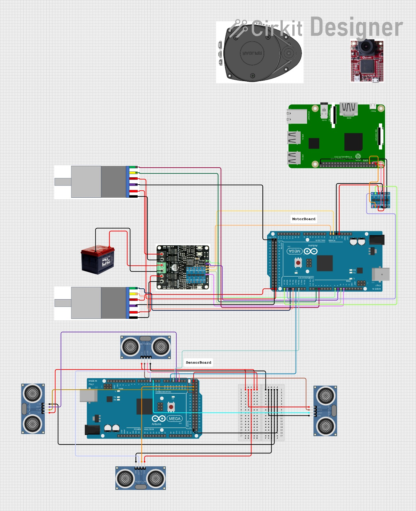

# Robotics Design Project

## Overview

This project contains two Arduino projects working together using PlatformIO:

1. **Motor Board**: Controls the robot's motors and executes movement commands
2. **Sensor Board**: Handles ultrasonic sensors to detect obstacles and send commands to the Motor Board

The system uses Serial communication between Arduinoboards, with additional Serial communication to a Raspberry Pi for higher-level control.

## Project Structure

```
robotics-design/
├── MotorBoard/
│   ├── src/
│   │   ├── MotorBoard.ino    # Main Motor Board code
│   │   └── class/
│   │       ├── Motor.h       # Motor class header
│   │       └── Motor.cpp     # Motor class implementation
│   └── platformio.ini        # PlatformIO configuration
│
└── SensorBoard/
    ├── src/
    │   ├── SensorBoard.ino   # Main Sensor Board code
    │   └── class/
    │       ├── Sensor.h      # Sensor class header
    │       └── Sensor.cpp    # Sensor class implementation
    └── platformio.ini        # PlatformIO configuration
```

## Communication Flow

1. Raspberry Pi -> Motor Board (Serial)
2. Sensor Board <-> Motor Board (Serial2)

## Features

- Ultrasonic obstacle detection in all directions (front, back, left, right)
- Emergency stop when obstacles are detected too close
- Proportional speed control for smooth navigation
- Motor encoder support for speed measurement
- Wall detection and avoidance logic (disabled for testing)
- Human detection mode for safety

## Commands for Serial Comm. PI -> MotorBoard

The Motor Board accepts the following command values:

- **100**: Stop both motors
- **101**: Disable wall detection (human detected in front)
- **102**: Turn left
- **103**: Turn right
- **104**: Move forward
- **105**: Move backward
- **-10 to 10**: Proportional speed control

## Commands for Serial Comm. SensorBoard <-> MotorBoard

The Motor Board accepts the following command values:

- **0**: Stop both motors
- **1**: Move forward
- **2**: Move backward
- **3**: Turn left
- **4**: Move right

## Development Status

- Basic obstacle detection and emergency stopping is implemented and functioning
- Wall detection and avoidance logic is implemented but currently disabled for testing
- Serial communication between boards is implemented
- The driving with proportional speed is already implemented and working

## Hardware Requirements

- 2 Arduino boards (one for Motor Board, one for Sensor Board)
- 4 ultrasonic sensors (HC-SR04 or similar)
- 2 DC motors with encoders
- Motor driver board
- Raspberry Pi (for higher-level control)

## Setup Instructions

1. Open the SensorBoard folder in VS Code and use PlatformIO to flash the code to the sensor control Arduino
2. Open the MotorBoard folder in a separate VS Code window and use PlatformIO to flash the code to the motor control Arduino
3. Connect the hardware according to the pin definitions in the code or the [wiring diagram](./wiring_diagram.jpg)
4. Power on the system and verify communication between boards



## Testing

For testing purposes, only the emergency breaking functionality is currently enabled. The more advanced wall detection and avoidance features are commented out in the code but ready for implementation once basic functionality is verified.

## Future Improvements

1. **Wall Detection Implementation**

- Enable and refine the currently disabled wall detection algorithms
- Test and calibrate wall following behavior
- Implement different wall avoidance strategies (parallel following vs. turning away)

2. **Speed Control Enhancement**

- Utilize motor encoders for closed-loop speed control
- Implement PID control for maintaining constant speed regardless of battery level
- Create acceleration/deceleration profiles for smoother movement

## Known Issues

- Occasional sensor reading fluctuations causing false obstacle detection
- Drift during turns due to motor variations
- Serial communication delays during rapid sensor updates
